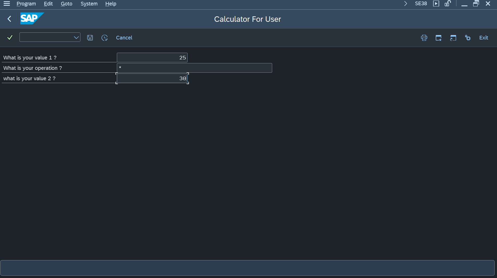
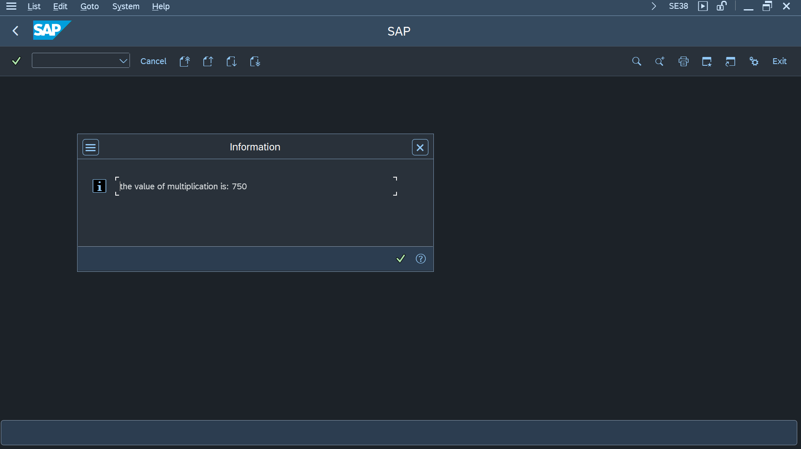

# Mini Calculadora ABAP OO

## Descrição
Este projeto contém um **report ABAP OO** chamado `ZR_CALCULATOR` que implementa uma mini calculadora com operações básicas: soma, subtração, multiplicação e divisão.  
O report utiliza uma **classe ABAP OO (`ZCL_MATH_CALCULATOR`)** para realizar os cálculos, com tratamento de exceções (como divisão por zero ou operação inválida) e mensagens personalizadas definidas via SE91.  
Os resultados das operações são armazenados na tabela `ZTCALC_LOG` para registro de histórico.

## Funcionalidades
- Soma, subtração, multiplicação e divisão de dois valores.
- Tratamento de erros aritméticos (divisão por zero e operação inválida).
- Mensagens de sucesso ou erro com números de mensagem configuráveis via SE91.
- Registro de cálculos na tabela `ZTCALC_LOG` após operações bem-sucedidas.

## Parâmetros do report
- `P_VALUE1` – Primeiro valor.
- `P_OP` – Operação (`+`, `-`, `*`, `/`).
- `P_VALUE2` – Segundo valor.

## Demonstração

### 1. Tela do report antes de rodar

### 2. Resultado após executar o cálculo

### 3. Tabela `ZTCALC_LOG` mostrando os cálculos registrados

## Observações
- Os IDs dos registros na tabela `ZTCALC_LOG` são gerados automaticamente usando `SELECT MAX(ID)` para garantir unicidade.
- Exceções são tratadas e exibidas como mensagens de erro sem quebrar a execução do report.
